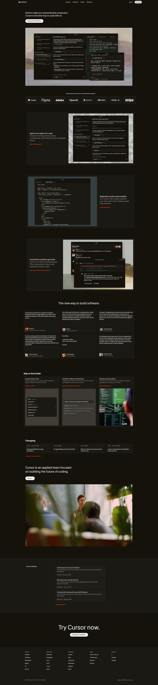

# Cursor Landing Page Clone

A static landing page built with **HTML and CSS** that recreates key sections of the Cursor website layout.  
This project focuses on structure, layout, typography, and visual consistency.

---

## Sections Recreated

The following sections were implemented:

1. **Header / Navbar**
   - Logo
   - Navigation links
   - Sign in and Download buttons

2. **Hero Section**
   - Main headline
   - Call-to-action button
   - Background image with editor overlay

3. **Brand Showcase**
   - Developer trust statement
   - Grid of brand logos

4. **Feature Sections**
   - Alternating text and image layouts
   - Highlighted product capabilities

5. **Testimonial Section**
   - Grid of customer quotes
   - Author images and roles

6. **Use Case Section**
   - Three feature cards
   - Image previews

7. **Changelog Section**
   - Version updates
   - Release dates

8. **Team Section**
   - Company message
   - Team image

9. **Highlight / Blog Section**
   - Recent highlights cards

10. **Final Call-to-Action Section**

- Download prompt

11. **Footer**

- Product, Resources, Company, Legal, and Connect links

---

## Fonts Used

### Primary Font

- **CursorGothic**
- Loaded via `@font-face`
- Used across the interface

```css
font-family: CursorGothic;
```

## Project Structure

```
cursor-clone/
│
├── index.html
├── style.css
│
├── images/
│   ├── logo/
│   ├── hero-bg-img.webp
│   ├── avatars/
│   └── feature images
│
└── fonts/
    └── CursorGothic_Regular.woff2
```

## Setup Instructions

1. **Clone or Download the Project**

```bash
git clone <repository-url>
```

2. **Open project Folder**

```bash
cd cursor-clone
```

1. **Clone or Download the Project**

```bash
git clone <repository-url>
```


